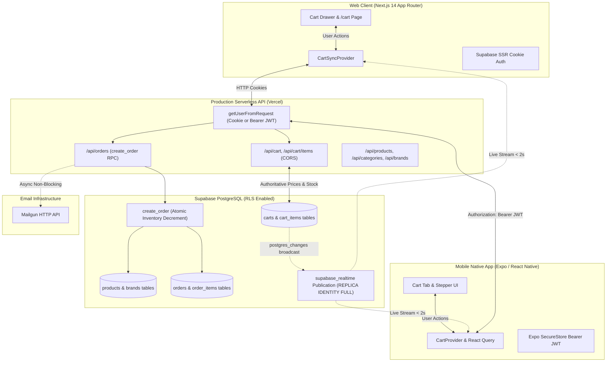

# BuildMart — Industrial Building Materials Marketplace & Real-Time Mobile Ecosystem

[](https://shopfront-green.vercel.app)
[](https://expo.dev/artifacts/eas/VYWxmTjv3NRWLwYrT0EtEKtEeINQa6divQ2NxpMgwME.apk)
[](https://nextjs.org)
[](https://expo.dev)
[](https://supabase.com)

**BuildMart** is an authoritative, high-performance building materials procurement ecosystem inspired by modern industrial logistics platforms (such as Cutstruct). It unifies a **Next.js 14 web application** and a **cross-platform Expo (React Native) mobile application** backed by a shared Supabase PostgreSQL database, authoritative pricing per unit, atomic inventory reservation, and **live bi-directional cart synchronization** streaming in real time (< 2 seconds) between web and mobile devices.

- **Production Web Application:** [https://shopfront-green.vercel.app](https://shopfront-green.vercel.app)
- **Standalone Android APK:** [Download buildmart.apk (EAS Build)](https://expo.dev/artifacts/eas/VYWxmTjv3NRWLwYrT0EtEKtEeINQa6divQ2NxpMgwME.apk)
- **Mobile Codebase:** [`/mobile`](./mobile)

---

## Architecture Overview



---

## Key Capabilities

### 1. One Account Identity Across Web and Phone
- A single user signs in with Google OAuth on either the web platform or the mobile app and accesses the exact same account.
- The mobile app employs a secure **Google OAuth PKCE flow** (`expo-web-browser` and `expo-linking`) storing JWT sessions in encrypted hardware storage via `expo-secure-store`.
- The unified backend auth layer (`src/lib/supabase/get-user.ts`) seamlessly accepts **either** browser HTTP cookies or mobile `Authorization: Bearer <token>` headers.

### 2. Live Bi-Directional Cart Sync (< 2 Seconds)
- Any item added, incremented, or removed on the website appears on the physical mobile phone in real time without refreshing, and vice-versa.
- Powered by PostgreSQL `REPLICA IDENTITY FULL` streaming through the `supabase_realtime` publication on `cart_items` with strict Row-Level Security (`auth.uid() = user_id`).
- Resilient client engine incorporates optimistic local updates, automatic re-connection upon network recovery, foreground re-fetching (`AppState`), and 5-second polling fallback.

### 3. Authoritative Construction Pricing & Site Haulage
- **Transparent Unit Pricing:** Every material displays authoritative pricing per unit (per bag, per 12m rod, per ton, per sheet, etc.) in Nigerian Naira (₦). Never hidden behind quotes or negotiation.
- **Integer Storage:** Stored strictly as integer minor units (kobo). Floating-point arithmetic is forbidden.
- **Flat-Rate Site Haulage:** Automatically incorporates transparent simulated site haulage calculations (flat ₦35,000 across Lagos & Abuja metropolises).
- **Atomic Checkout:** Orders execute through an isolated PostgreSQL transaction that locks products (`FOR UPDATE`), clamps inventory, and decrements stock atomically.

### 4. Polished Dual-Theme Design System
- Built to match modern industrial standards:
  - **Dark Theme:** Deep navy-black (`#0B1220`), elevated surfaces (`#131D31`), hairline borders (`#1F2E4A`), high-contrast text (`#F8FAFC`).
  - **Light Theme:** Crisp white (`#FFFFFF`), cool secondary surfaces (`#F8FAFC`), hairline borders (`#E2E8F0`).
  - **ONE Accent Color:** Construction safety orange (`#F58A2B` / `#EA580C`) passing WCAG AA contrast standards.

---

## Tech Stack

| Layer | Web Application | Mobile Application |
|---|---|---|
| **Framework** | Next.js 14+ (App Router) | Expo SDK 57 (React Native 0.86, React 19) |
| **Language** | TypeScript (Strict mode, 0 `any`) | TypeScript (Strict mode, 0 `any`) |
| **Styling** | Tailwind CSS + CSS custom properties | React Native StyleSheet + Theme tokens |
| **Navigation** | Next.js App Router | Expo Router (File-based navigation) |
| **State / Cache** | Zustand (`persist`) + Realtime sync | `@tanstack/react-query` + Realtime sync |
| **Auth & Database**| Supabase (`@supabase/ssr` cookies) | `@supabase/supabase-js` + `expo-secure-store` |
| **Forms / Schema**| Zod + `react-hook-form` | Zod + React Native controlled inputs |
| **Build / Deploy** | Vercel Serverless & Edge Middleware | EAS Build (Android Standalone APK) |

---

## API Surface & Endpoints

All endpoints are validated via **Zod**, return consistent JSON schemas, and include cross-origin resource sharing (**CORS**):

| Endpoint | Method | Auth | Description |
|---|---|---|---|
| `/api/health` | `GET` | Public | System status and timestamp |
| `/api/categories` | `GET` | Public | Returns all 11 certified construction categories |
| `/api/brands` | `GET` | Public | Returns all 24 manufacturer brands |
| `/api/products` | `GET` | Public | Filter by search, category, brand, sort, pagination |
| `/api/products/:slug` | `GET` | Public | Product specifications, brand, price, stock |
| `/api/cart` | `GET` | User (Cookie/Bearer) | Retrieves user's live cart with authoritative totals |
| `/api/cart` | `DELETE` | User (Cookie/Bearer) | Clears all items in the user's cart |
| `/api/cart/items` | `POST` | User (Cookie/Bearer) | Add or increment item (clamped to stock; 409 if unavailable) |
| `/api/cart/items/:id` | `PATCH` | User (Cookie/Bearer) | Updates item quantity |
| `/api/cart/items/:id` | `DELETE` | User (Cookie/Bearer) | Removes single item from cart |
| `/api/cart/merge` | `POST` | User (Cookie/Bearer) | Merges guest localStorage cart into server cart upon sign-in |
| `/api/orders` | `GET` | User (Cookie/Bearer) | Order history with status and item summaries |
| `/api/orders` | `POST` | User (Cookie/Bearer) | Atomic order creation via `create_order` PostgreSQL RPC |
| `/api/orders/:id` | `GET` | User (Cookie/Bearer) | Single order details with unit snapshots |
| `/api/orders/:id/resend-email` | `POST` | User (Cookie/Bearer) | Resends Mailgun order confirmation email |

---

## Database Schema & Migrations

The database runs on Supabase PostgreSQL with full Row-Level Security:

1. **`products`**: Authentic building products with JSONB technical specifications, units, and inventory caps.
2. **`categories`** & **`brands`**: Catalog taxonomy.
3. **`carts`**: Cart header tied to `auth.users(id)`.
4. **`cart_items`**: User-product join with check constraints (`quantity > 0 AND quantity <= 10000`). Enforces `REPLICA IDENTITY FULL` for Supabase Realtime broadcast.
5. **`orders`** & **`order_items`**: Immutable order records holding `unit_snapshot` and flat haulage calculations.
6. **`email_logs`**: Asynchronous dispatch audit logs.
7. **`create_order` RPC**: Atomic transaction performing inventory reservation and order persistence.

---

## Getting Started Locally

### 1. Web Application

```bash
# Clone the repository
git clone https://github.com/Collinsthegreat/shopfront.git
cd shopfront

# Install dependencies
npm install

# Configure environment variables
cp .env.example .env.local

# Run development server
npm run dev
```

Open [http://localhost:3000](http://localhost:3000) in your browser.

---

### 2. Mobile Application (Expo)

```bash
cd mobile

# Install mobile dependencies
npm install

# Start Metro bundler
npx expo start
```

- **Physical iPhone / Android (Expo Go):** Open your camera or the Expo Go app and scan the QR code.
- **Tunnel Mode (Recommended across different networks):**
  ```bash
  npx expo start --tunnel
  ```

---

## Building the Standalone Mobile APK

The mobile application is pre-configured with **EAS Build** (`mobile/eas.json`):

```bash
cd mobile
npx eas-cli build -p android --profile preview
```

The generated standalone `.apk` installs directly on physical Android devices without requiring a running development server or Metro bundler.

- **Verified Build Artifact:** [Download buildmart.apk](https://expo.dev/artifacts/eas/VYWxmTjv3NRWLwYrT0EtEKtEeINQa6divQ2NxpMgwME.apk)

---

## Testing & Verification

```bash
# Web unit & integration tests (Vitest)
npm test

# TypeScript typecheck (Web)
npm run typecheck

# TypeScript typecheck (Mobile)
cd mobile && npx tsc --noEmit

# Code linting
npm run lint

# Production compilation
npm run build
```

Full physical device testing procedures and step-by-step verification checklists are documented in [`docs/device-test.md`](./docs/device-test.md).

---

## License

This project is developed for educational and portfolio demonstration purposes. All rights reserved.
