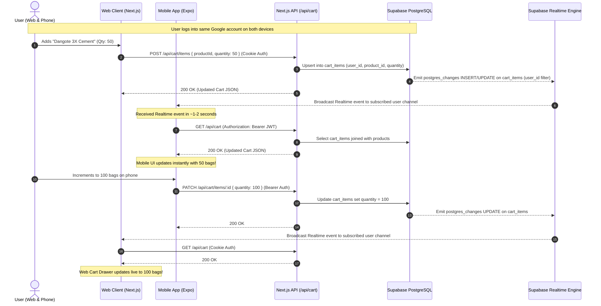

# Mobile Plan — BuildMart Mobile Expansion & Real-Time Sync

> **Architectural Specification & Gap Analysis**  
> **Target:** Native Mobile App (Expo / React Native) with Shared Supabase Backend & Live Web-Mobile Cart Sync  
> **Date:** October 2026

---

## 1. Executive Summary
BuildMart is currently a Next.js 14 web application deployed on Vercel backed by Supabase PostgreSQL (with RLS), Supabase Auth (Google OAuth), and Mailgun email delivery.

The objective is to expand BuildMart into a **cross-platform ecosystem** by delivering a production-grade **Expo (React Native) mobile application** residing in `/mobile`. Both the web storefront and the mobile application will share:
1. **The Exact Same Account:** Single Supabase Auth user identity via Google OAuth.
2. **Live Bi-Directional Cart Sync:** Changes made on the website reflect on the mobile app within 1–2 seconds, and vice-versa, powered by PostgreSQL persistence and Supabase Realtime pub/sub.
3. **The Exact Same Production Backend:** All requests route through the deployed Next.js API endpoints (`https://shopfront-green.vercel.app/api/...`), ensuring 100% authoritative pricing, atomic inventory decrements, and consistent order management.

---

## 2. Current Architecture & API Surface Analysis

### Existing Web API Surface (`/src/app/api`)
| Route | Method | Auth Required | Current Authentication Mechanism | Purpose |
|---|---|---|---|---|
| `/api/health` | `GET` | No | Public | Healthcheck and timestamp |
| `/api/products` | `GET` | No | Public | Filtered, sorted, paginated product catalog |
| `/api/orders` | `GET` | **Yes** | Cookie only (`@supabase/ssr` cookies) | Retrieve signed-in user's order history |
| `/api/orders` | `POST` | **Yes** | Cookie only (`@supabase/ssr` cookies) | Atomic `create_order` RPC execution |
| `/api/orders/[id]` | `GET` | **Yes** | Cookie only (`@supabase/ssr` cookies) | Retrieve single order (user isolated) |
| `/api/orders/[id]/resend-email` | `POST` | **Yes** | Cookie only (`@supabase/ssr` cookies) | Resend Mailgun confirmation email |
| `/api/dev/test-email` | `POST` | No | Public / Dev only | Test Mailgun SMTP/HTTP dispatch |

### Current Authentication & Session Model
- **Web Auth Implementation:** Uses `@supabase/ssr` (`createBrowserClient` on client and `createServerClient` in `src/lib/supabase/server.ts`).
- **Session Transport:** Strictly **HTTP Cookies** synchronized by Next.js edge middleware (`src/middleware.ts`) and route handlers via `cookies()` from `next/headers`.
- **OAuth Exchange:** Client initiates Google OAuth redirecting to `/auth/callback`, which exchanges the OAuth authorization code for session tokens stored in browser cookies.

### Current Cart Model
- **Cart Storage:** Strictly **Client-Side `localStorage`** via Zustand `persist` middleware (`buildmart_cart_v1`).
- **Database Presence:** **Zero server-side cart tables.** No tables exist in Supabase for carts or cart items.
- **Sync Capability:** None. Carts cannot sync across browser tabs, across incognito sessions, or to external clients.

---

## 3. Gap Analysis Blocking Core Requirements

### Gap 1: Authentication & Token Compatibility (Requirement 1: One Account)
* **The Problem:** Mobile native apps running in Expo/React Native cannot natively exchange or manage Next.js SSR HTTP cookies across cross-origin REST requests (`https://shopfront-green.vercel.app/api/...`). Mobile apps authenticate via `@supabase/supabase-js`, obtaining a **JWT Access Token**. All current API routes call `supabase.auth.getUser()` purely through the cookie jar, causing mobile requests to fail with `401 Unauthorized`.
* **The Solution:**
  1. Build a unified authentication helper: `src/lib/supabase/get-user.ts`.
  2. The helper inspects the incoming request:
     - If an `Authorization: Bearer <token>` header is present, validate the JWT directly using `supabase.auth.getUser(token)`.
     - If no Bearer header is present, fall back to reading the cookie session via `@supabase/ssr` `createServerClient`.
  3. Refactor all protected endpoints (`/api/orders`, `/api/orders/[id]`, `/api/orders/[id]/resend-email`, and new cart endpoints) to use `getUserFromRequest(request)`.

### Gap 2: Server-Side Cart Persistence & Realtime Pub/Sub (Requirement 2: Live Cart Sync)
* **The Problem:** The cart currently exists only in the browser's `localStorage`. Without database persistence and streaming events, bi-directional sync between web and phone is impossible.
* **The Solution:**
  1. **Database Schema:** Create `carts` and `cart_items` tables with Foreign Keys, `user_id`, `product_id`, `quantity`, and check constraints.
  2. **Row Level Security (RLS):** Strict RLS policies ensuring users can only read, insert, update, and delete their own cart rows (`auth.uid() = user_id`).
  3. **Realtime Publication:** Enable `REPLICA IDENTITY FULL` on `cart_items` and add the table to `supabase_realtime` publication.
  4. **Cart API Endpoints:**
     - `GET /api/cart`: Returns items joined with live product data (name, price_kobo, unit, image_url, stock) and authoritative subtotal.
     - `POST /api/cart/items`: Adds or increments items, clamping to available product stock.
     - `PATCH /api/cart/items/[productId]`: Updates item quantity (or deletes if <= 0).
     - `DELETE /api/cart/items/[productId]`: Deletes specific cart item.
     - `DELETE /api/cart`: Clears entire cart for user.
     - `POST /api/cart/merge`: Merges a guest cart (from local storage) into the server cart upon sign-in.
  5. **Client Realtime Subscription:**
     - Subscribe to Supabase Realtime channel for `postgres_changes` on `cart_items` with filter `user_id=eq.<id>`.
     - On any event (`INSERT`, `UPDATE`, `DELETE`), invalidate cache and re-fetch `/api/cart`.
     - Fallback polling every 5 seconds if Realtime disconnects, plus refetch on tab/app focus.

### Gap 3: Missing Catalog Endpoints & CORS Support (Requirement 4: Same API)
* **The Problem:** The mobile app requires direct endpoints to fetch individual product details by slug, list categories, and list brands. Additionally, mobile apps require proper CORS headers on public APIs.
* **The Solution:**
  1. Add `GET /api/products/[slug]`.
  2. Add `GET /api/categories`.
  3. Add `GET /api/brands`.
  4. Ensure standard CORS headers (`Access-Control-Allow-Origin: *`, `Access-Control-Allow-Headers: Authorization, Content-Type`) across public endpoints.
  5. Document all endpoints in `docs/api.md`.

### Gap 4: Mobile App Architecture & Infrastructure (Requirement 3: Physical Device Test)
* **The Problem:** No mobile application exists in the repository.
* **The Solution:**
  1. Scaffold Expo project in `/mobile` with Expo Router, TypeScript strict mode, and TanStack Query.
  2. Configure `expo-secure-store` for JWT persistence (replacing insecure AsyncStorage).
  3. Implement Google OAuth with PKCE flow via `expo-web-browser` and `expo-linking` using the same Supabase project.
  4. Match BuildMart design system: dark `#0B1220` and crisp white themes with safety orange `#F58A2B` accent, 1:1 image tiles, authoritative pricing per unit.
  5. Provide `eas.json` for preview APK generation and Expo Go workflow for immediate testing.

---

## 4. End-to-End Cart Sync State Machine

---

## 5. Implementation Roadmap & Milestones

1. **Phase 1: Database Migration & Realtime Configuration**
   - Migration file: `20261004000000_cart_realtime_schema.sql`.
   - Tables: `carts`, `cart_items` with RLS policies, index optimizations, `REPLICA IDENTITY FULL`, and addition to `supabase_realtime` publication.
   - Run SQL in Supabase.

2. **Phase 2: Backend Unified Auth & Complete Cart API**
   - Implement `src/lib/supabase/get-user.ts` (Dual Cookie / Bearer JWT support).
   - Update `/api/orders`, `/api/orders/[id]`, `/api/orders/[id]/resend-email` to use unified auth.
   - Implement `/api/cart` (GET, DELETE), `/api/cart/items` (POST), `/api/cart/items/[productId]` (PATCH, DELETE), `/api/cart/merge` (POST).
   - Implement `/api/products/[slug]`, `/api/categories`, `/api/brands` with CORS.
   - Document in `docs/api.md` and verify with Vitest API unit tests.

3. **Phase 3: Web Cart Refactoring**
   - Upgrade Zustand store in `src/lib/cart/store.ts` to coordinate with server-side cart.
   - Implement guest cart merge on user sign-in.
   - Integrate Supabase Realtime channel subscription with automatic reconnection, visibility/focus refetching, and 5s polling fallback.
   - Verify on local dev server and test suite.

4. **Phase 4: Mobile App Scaffolding (`/mobile`)**
   - Initialize Expo Router app with TypeScript strict mode.
   - Set up API client with Bearer token interceptor, TanStack Query, and `expo-secure-store`.
   - Implement design tokens: Navy-black `#0B1220`, white light mode, safety orange `#F58A2B`.
   - Setup Google OAuth PKCE flow (`signInWithOAuth` via `expo-web-browser` and `expo-linking`).

5. **Phase 5: Mobile Screens & Features**
   - Home, Marketplace (search, category pills, filter bottom sheet, 2-col grid), Product Detail (bulk stepper, specs).
   - Live Synced Cart screen with Realtime subscription, optimistic updates, and delivery fee calculation.
   - Checkout screen with Zod validation, simulated POD, and order creation.
   - Order Confirmation & My Orders history.

6. **Phase 6: Verification, Testing & Deployment**
   - Two-client Realtime sync automated test (`tests/sync-test.ts` / `docs/sync-test.md`).
   - Mobile test suite (Jest + React Native Testing Library).
   - Build preview APK configuration (`eas.json`) and Expo Go instructions.
   - Device test checklist: `docs/device-test.md`.
   - Production deployment to Vercel and repository synchronization.
